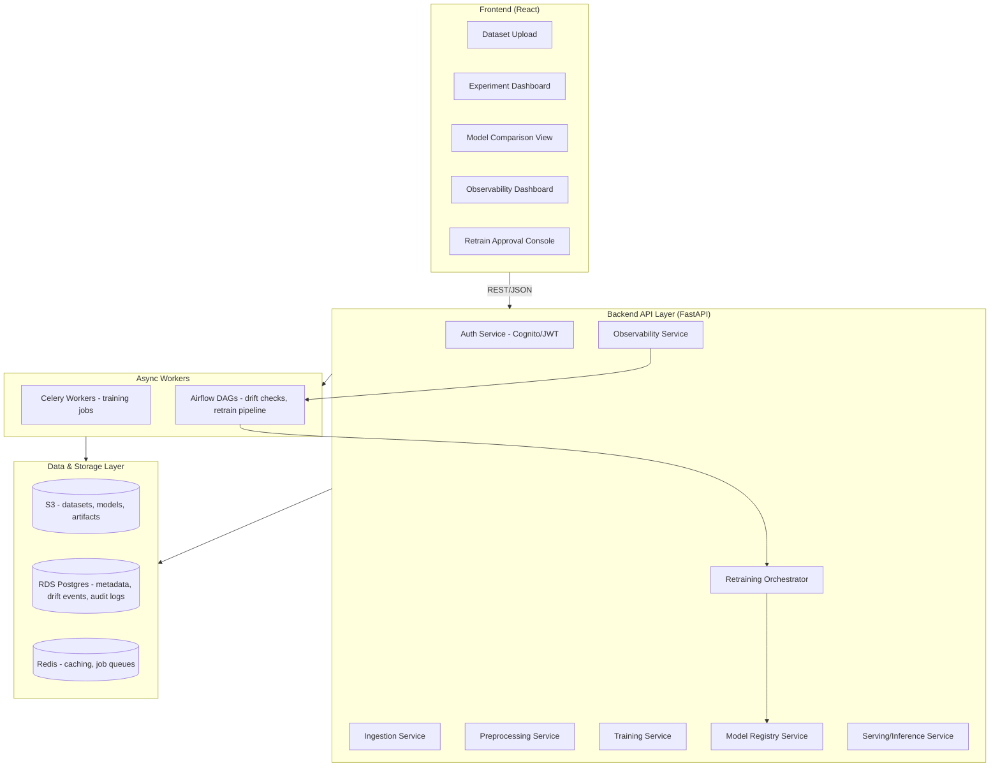
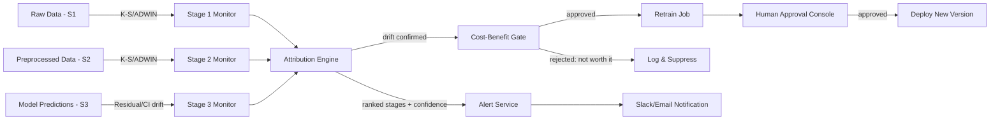
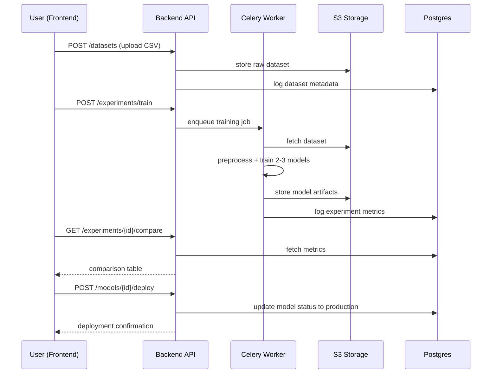
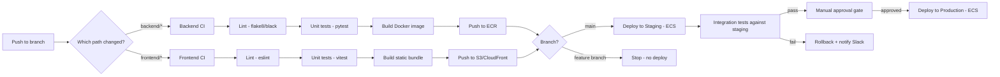

# Multi-Model MLOps Observability Platform
## Complete Build Document — Requirements, Architecture, Tech Stack, CI/CD & Phase-Wise Plan

---

## 1. Project Summary

An industry-grade MLOps platform covering the full model lifecycle — ingestion, preprocessing, multi-model training, deployment, and **stage-wise drift observability with root-cause localization**. Built to be demoed as a working product, not a notebook.

**Differentiator:** Most MLOps tools flag "drift detected" at the output only. This platform independently monitors ingestion, preprocessing, and prediction stages, then ranks which stage most likely caused a given drift event.

---

## 2. Functional Requirements

### 2.1 Data & Training
| ID | Requirement |
|---|---|
| FR1 | Upload dataset (CSV), with schema validation on ingest |
| FR2 | Automated, versioned preprocessing pipeline (missing values, encoding, scaling) |
| FR3 | Train 2–3 models in parallel per dataset; log params/metrics/artifacts per run |
| FR4 | Model comparison view (accuracy, F1, latency, resource cost, side by side) |
| FR5 | Model registry with versioning and staging/production states |

### 2.2 Serving
| ID | Requirement |
|---|---|
| FR6 | Deploy selected model as a containerized REST API |
| FR7 | Log every prediction request/response (needed as drift baseline data) |

### 2.3 Observability (core differentiator)
| ID | Requirement |
|---|---|
| FR8 | Independent drift monitors at ingestion, preprocessing-output, and prediction-output stages |
| FR9 | Per-stage drift score + timestamp of first threshold crossing |
| FR10 | Root-cause attribution engine — ranks stages by drift magnitude × inverse onset-lag |
| FR11 | Alerting (Slack/email) with the ranked attribution report attached |

### 2.4 Retraining
| ID | Requirement |
|---|---|
| FR12 | Rule-based retrain trigger: drift confirmed + error threshold + cost-benefit check passes |
| FR13 | Human approval gate before promoting a retrained model to production |
| FR14 | Full audit log: what triggered retrain, what changed, who approved |

### 2.5 Platform/Admin
| ID | Requirement |
|---|---|
| FR15 | Auth + RBAC (viewer/engineer/admin roles) |
| FR16 | SLA tiering per model (monitoring frequency, alert sensitivity by criticality) |
| FR17 | Multi-tenant dashboard — all models' health on one screen |

---

## 3. Non-Functional Requirements

| Category | Requirement |
|---|---|
| Latency | Inference API p95 < 300ms |
| Scalability | Support 20+ concurrent model pipelines per platform instance |
| Security | RBAC enforced at API layer; no unnecessary PII retained |
| Cost visibility | Every retrain job logs estimated compute cost before execution |
| Auditability | Every model promotion and retrain traceable to a triggering event and approver |
| Availability | Serving API target uptime 99.5% within demo/staging environment |
| Reproducibility | Every experiment run's data version + code commit + params are recoverable |

---

## 4. System Architecture

### 4.1 High-Level Component Diagram



### 4.2 Observability Engine Detail



### 4.3 Request Flow — Training to Deployment



### 4.4 Repository Structure

```
mlops-observability-platform/
├── frontend/                      # React app
│   ├── src/
│   │   ├── pages/
│   │   │   ├── DatasetUpload.jsx
│   │   │   ├── ExperimentDashboard.jsx
│   │   │   ├── ModelComparison.jsx
│   │   │   ├── ObservabilityDashboard.jsx
│   │   │   └── RetrainApproval.jsx
│   │   ├── components/
│   │   ├── api/
│   │   └── App.jsx
│   ├── tests/
│   └── package.json
│
├── backend/
│   ├── app/
│   │   ├── api/
│   │   │   ├── datasets.py
│   │   │   ├── experiments.py
│   │   │   ├── models.py
│   │   │   ├── observability.py
│   │   │   └── retrain.py
│   │   ├── services/
│   │   │   ├── ingestion_service.py
│   │   │   ├── preprocessing_service.py
│   │   │   ├── training_service.py
│   │   │   ├── registry_service.py
│   │   │   ├── serving_service.py
│   │   │   ├── drift/
│   │   │   │   ├── stage_monitors.py
│   │   │   │   ├── attribution_engine.py
│   │   │   │   └── cost_benefit_gate.py
│   │   │   └── retrain_orchestrator.py
│   │   ├── models/
│   │   ├── workers/
│   │   ├── core/
│   │   └── main.py
│   ├── dags/
│   │   ├── drift_check_dag.py
│   │   └── retrain_dag.py
│   ├── tests/
│   └── requirements.txt
│
├── infra/
│   ├── terraform/
│   │   ├── vpc.tf
│   │   ├── rds.tf
│   │   ├── s3.tf
│   │   ├── ecs.tf
│   │   └── cognito.tf
│   └── docker-compose.yml
│
├── .github/
│   └── workflows/
│       ├── backend-ci.yml
│       ├── frontend-ci.yml
│       └── deploy.yml
│
├── docs/
│   └── api-spec.yaml
└── README.md
```

---

## 5. Tech Stack

### 5.1 Frontend
| Layer | Tool | Why |
|---|---|---|
| Framework | React 18 + Vite | Fast dev loop, industry-standard |
| Styling | Tailwind CSS | Rapid, consistent UI without custom CSS overhead |
| Charts | Recharts / Chart.js | Drift score trends, model comparison bars |
| State | React Query | Server-state caching for API calls |
| Auth | AWS Amplify (Cognito integration) | Matches backend auth |
| Testing | Vitest + React Testing Library | Component + integration tests |

### 5.2 Backend
| Layer | Tool | Why |
|---|---|---|
| API Framework | FastAPI (Python) | Async, typed, auto-generates OpenAPI docs |
| ORM | SQLAlchemy + Alembic | Migrations, type-safe queries |
| Async jobs | Celery + Redis | Training jobs shouldn't block API requests |
| Orchestration | Apache Airflow | Drift-check DAGs, retrain DAGs |
| ML Libraries | scikit-learn, XGBoost, Prophet | Classification/regression + time-series forecasting |
| Drift Detection | `scipy.stats` (K-S test), `river` (ADWIN) | Proven, lightweight, matches AutoDrift's toolchain |
| Testing | Pytest + pytest-asyncio | Unit + integration test coverage |

### 5.3 Data & Storage
| Layer | Tool | Why |
|---|---|---|
| Object storage | AWS S3 | Datasets, model artifacts, logs |
| Relational DB | AWS RDS (Postgres) | Experiment metadata, drift events, audit logs |
| Cache/Queue | Redis (ElastiCache) | Celery broker + API response caching |

### 5.4 Infrastructure & DevOps
| Layer | Tool | Why |
|---|---|---|
| Compute | ECS Fargate | Training/preprocessing jobs — no server management |
| API hosting | Lambda + API Gateway (light endpoints) or ECS (heavier services) | Reuses your existing AWS architecture pattern |
| Container | Docker | Consistent local/prod environments |
| Container Registry | Amazon ECR | Versioned image storage for CI/CD |
| IaC | Terraform | Reproducible infra, version-controlled |
| CI/CD | GitHub Actions | Build, test, deploy on push (detailed in Section 6) |
| Auth | AWS Cognito | User pools, RBAC token claims |
| Monitoring (platform itself) | CloudWatch | Infra-level logs/metrics, separate from the ML observability engine |
| Secrets | AWS Secrets Manager | DB credentials, API keys — never in repo/env files |

### 5.5 Observability Engine (in-house)
| Component | Tool |
|---|---|
| Stage monitors | Custom Python module using `scipy.stats.ks_2samp` + `river.drift.ADWIN` |
| Attribution engine | Custom scoring logic (temporal-onset + magnitude weighting) |
| Alerting | AWS SNS → Slack webhook |

---

## 6. CI/CD Pipeline

### 6.1 Pipeline Overview



### 6.2 Workflow Breakdown

**`backend-ci.yml`** — triggers on any push/PR touching `backend/**`
1. Checkout code
2. Set up Python 3.11, install dependencies (`pip install -r requirements.txt`)
3. Lint: `black --check .` and `flake8`
4. Run unit tests: `pytest --cov=app --cov-report=xml`
5. Fail the build if coverage drops below an agreed threshold (start at 60%, raise over time)
6. Build Docker image, tag with commit SHA
7. Push image to Amazon ECR (only on `main` branch)

**`frontend-ci.yml`** — triggers on any push/PR touching `frontend/**`
1. Checkout code
2. Set up Node 20, `npm ci`
3. Lint: `eslint .`
4. Run tests: `npm run test`
5. Build production bundle: `npm run build`
6. Upload build artifact (only deployed on `main`)

**`deploy.yml`** — triggers after both CI workflows succeed on `main`
1. Deploy backend image to ECS staging service (`aws ecs update-service --force-new-deployment`)
2. Deploy frontend bundle to S3 + invalidate CloudFront cache
3. Run integration test suite against staging URL (Postman/Newman or Pytest hitting live staging endpoints)
4. On pass: pause for **manual approval** (GitHub Environments protection rule)
5. On approval: repeat deploy steps against production ECS service + CloudFront
6. On any failure: auto-rollback ECS service to previous task definition, notify Slack via webhook

### 6.3 Environments

| Environment | Purpose | Deploy trigger |
|---|---|---|
| Local | Development | `docker-compose up` |
| Staging | Integration testing, demo | Auto-deploy on merge to `main` |
| Production | Live demo instance | Manual approval after staging passes |

### 6.4 Branch Strategy

- `main` — always deployable, protected, requires PR + passing CI to merge
- `feature/*` — one branch per FR (e.g., `feature/fr8-stage-monitors`) — keeps Phase 2 work traceable to specific requirements
- Squash-merge to `main` to keep history readable for a portfolio repo

---

## 7. Database Schema (core tables)

```sql
CREATE TABLE datasets (
    id UUID PRIMARY KEY,
    name VARCHAR(255),
    s3_path VARCHAR(512),
    schema_json JSONB,
    uploaded_at TIMESTAMP,
    owner_id UUID
);

CREATE TABLE experiment_runs (
    id UUID PRIMARY KEY,
    dataset_id UUID REFERENCES datasets(id),
    model_type VARCHAR(100),
    params JSONB,
    metrics JSONB,
    artifact_s3_path VARCHAR(512),
    created_at TIMESTAMP
);

CREATE TABLE model_versions (
    id UUID PRIMARY KEY,
    run_id UUID REFERENCES experiment_runs(id),
    status VARCHAR(50), -- staging | production | archived
    deployed_at TIMESTAMP
);

CREATE TABLE predictions (
    id UUID PRIMARY KEY,
    model_version_id UUID REFERENCES model_versions(id),
    input_snapshot JSONB,
    output JSONB,
    predicted_at TIMESTAMP
);

CREATE TABLE drift_events (
    id UUID PRIMARY KEY,
    model_version_id UUID REFERENCES model_versions(id),
    stage VARCHAR(50), -- S1_ingestion | S2_preprocessing | S3_output
    drift_score FLOAT,
    onset_timestamp TIMESTAMP,
    detected_at TIMESTAMP
);

CREATE TABLE attribution_reports (
    id UUID PRIMARY KEY,
    drift_event_ids UUID[],
    ranked_stages JSONB,   -- [{stage, score, confidence}, ...]
    generated_at TIMESTAMP
);

CREATE TABLE retrain_jobs (
    id UUID PRIMARY KEY,
    model_version_id UUID REFERENCES model_versions(id),
    trigger_reason JSONB,
    cost_estimate FLOAT,
    approved_by UUID,
    status VARCHAR(50), -- pending | approved | rejected | completed
    created_at TIMESTAMP
);

CREATE TABLE audit_logs (
    id UUID PRIMARY KEY,
    actor_id UUID,
    action VARCHAR(100),
    target_type VARCHAR(50),
    target_id UUID,
    metadata JSONB,
    created_at TIMESTAMP
);
```

---

## 8. API Surface (representative, REST)

```
POST   /auth/login                            authenticate, return JWT
POST   /datasets                               upload + validate
GET    /datasets/{id}                          dataset metadata
POST   /experiments/train                      kick off multi-model training run
GET    /experiments/{id}/compare               metrics comparison
POST   /models/{id}/deploy                     promote to production
GET    /models/{id}/predict                    inference
GET    /observability/{model_id}/drift         current drift status per stage
GET    /observability/{model_id}/attribution   ranked root-cause report
POST   /retrain/{model_id}/trigger             manual/rule-based retrain request
POST   /retrain/{job_id}/approve               human approval gate
GET    /audit-logs                             filterable audit trail
GET    /admin/models                           multi-tenant dashboard data
```

---

## 9. Phase-Wise Build Plan

### Phase 0 — Setup & CI/CD Foundation (Week 1)
- [ ] Repo scaffolding (frontend + backend folders as in Section 4.4)
- [ ] Docker Compose for local dev (Postgres, Redis, backend, frontend)
- [ ] Terraform skeleton for AWS resources (VPC, S3, RDS, Cognito, ECR) — define, don't provision yet
- [ ] `backend-ci.yml` and `frontend-ci.yml` — lint + test on every push (no deploy yet)
- [ ] Branch protection rules on `main` (require passing CI + 1 review, even if reviewing your own PRs for now)

**Exit criteria:** `docker-compose up` runs a working local stack; a PR against `main` triggers CI and blocks merge on failure.

---

### Phase 1 — MVP: Core Lifecycle (Weeks 2–5)
**Goal:** Upload → preprocess → train → compare → deploy, fully working end-to-end.

- [ ] `POST /datasets` — upload + schema validation, store in S3, metadata in RDS (FR1)
- [ ] Preprocessing service — versioned cleaning/encoding/scaling (FR2)
- [ ] Training service — Celery task, trains 2–3 models on same dataset (FR3)
- [ ] Experiment tracking — log params/metrics/artifacts per run
- [ ] `GET /experiments/{id}/compare` — metrics comparison endpoint (FR4)
- [ ] Model registry — staging/production states (FR5)
- [ ] `POST /models/{id}/deploy` — promote model, spin up serving endpoint (FR6)
- [ ] Serving API — `/predict`, logs every request/response (FR7)
- [ ] Frontend: Dataset Upload, Experiment Dashboard, Model Comparison view
- [ ] `deploy.yml` activated — auto-deploy to staging on merge to `main`

**Exit criteria:** Can upload a real dataset, train 3 models, compare metrics in UI, deploy the best one, and hit `/predict` — all running on staging via the CI/CD pipeline, not just locally.

---

### Phase 2 — Observability Core (Weeks 6–9)
**Goal:** Stage-wise drift detection + root-cause attribution, live on a deployed model.

- [ ] Stage 1 monitor — K-S/ADWIN on raw ingested data vs. training baseline (FR8)
- [ ] Stage 2 monitor — K-S/ADWIN on preprocessed feature distributions (FR8)
- [ ] Stage 3 monitor — residual/prediction-error drift + confidence-interval tracking (FR8)
- [ ] `drift_events` logging — every stage check writes a score + timestamp (FR9)
- [ ] Attribution engine — temporal-onset + magnitude-weighted scoring (FR10)
- [ ] `GET /observability/{model_id}/drift` and `/attribution` endpoints
- [ ] Airflow DAG — scheduled drift checks (data_load → stage_checks → attribution → alert)
- [ ] Alert service — SNS → Slack webhook with ranked attribution report (FR11)
- [ ] Frontend: Observability Dashboard — per-stage drift trend lines + attribution report view
- [ ] Integration tests added to `deploy.yml` — verify drift endpoints against staging

**Exit criteria:** Inject synthetic drift into a known stage on a deployed model; the dashboard correctly surfaces that stage as top-ranked root cause within one DAG run, and this is covered by an automated integration test.

---

### Phase 3 — Retraining Loop (Weeks 10–12)
**Goal:** Closed-loop retraining with cost-benefit gating and human approval.

- [ ] Cost-benefit gate — estimate compute cost vs. expected accuracy gain (FR12)
- [ ] `retrain_jobs` table + orchestrator service
- [ ] Airflow DAG — retrain trigger → cost check → pending approval → (if approved) retrain → redeploy
- [ ] Human approval endpoint + frontend console (FR13)
- [ ] Audit logging — every retrain decision traceable to trigger + approver (FR14)
- [ ] Manual approval gate wired into `deploy.yml` for production releases (GitHub Environments)

**Exit criteria:** A drift event correctly triggers a retrain job that sits in "pending approval"; approving it results in a new model version deployed with a full audit trail, and a production deploy requires the same kind of human gate.

---

### Phase 4 — Platform Hardening (Weeks 13–15)
**Goal:** Make it look and behave like a real product, not a student project.

- [ ] Auth + RBAC (Cognito, viewer/engineer/admin roles enforced at API layer) (FR15)
- [ ] SLA tiering — critical/standard/low-priority models, adjusted monitoring cadence (FR16)
- [ ] Multi-tenant dashboard — all models' health on one screen (FR17)
- [ ] Error handling, input validation, rate limiting across all endpoints
- [ ] Load testing (Locust/JMeter) on serving endpoint — validate p95 < 300ms NFR
- [ ] Raise test coverage threshold in CI from 60% to 75%+
- [ ] README + architecture docs + demo video/script

**Exit criteria:** A stranger could clone the repo, run `docker-compose up`, and walk through the full lifecycle without your help — and a fresh PR against `main` is blocked unless it passes lint, tests, and coverage in CI.

---

## 10. What to Cut First If Time Runs Short

1. **Cut first:** Phase 4 RBAC/multi-tenant (document as roadmap, don't build)
2. **Cut second:** Phase 3 cost-benefit gate — replace with a simple rule-based retrain trigger
3. **Simplify, don't cut:** CI/CD — keep lint + test + staging deploy; drop the manual-approval production gate if time is short
4. **Never cut:** Phase 2 — this is the differentiator; without it, this is just another MLOps CRUD app

---

## 11. Local Dev Quickstart (for README)

```bash
git clone <repo>
cd mlops-observability-platform
docker-compose up --build
# Frontend: http://localhost:3000
# Backend API docs: http://localhost:8000/docs
```

---

*End of build document.*
