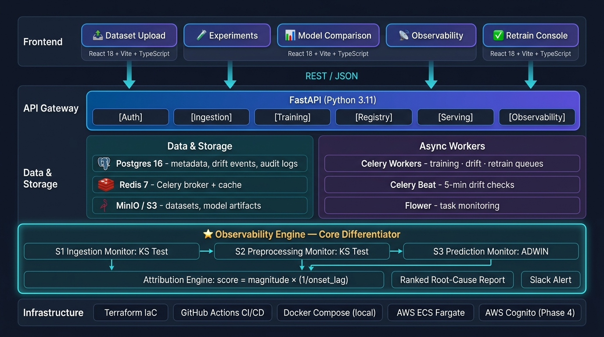
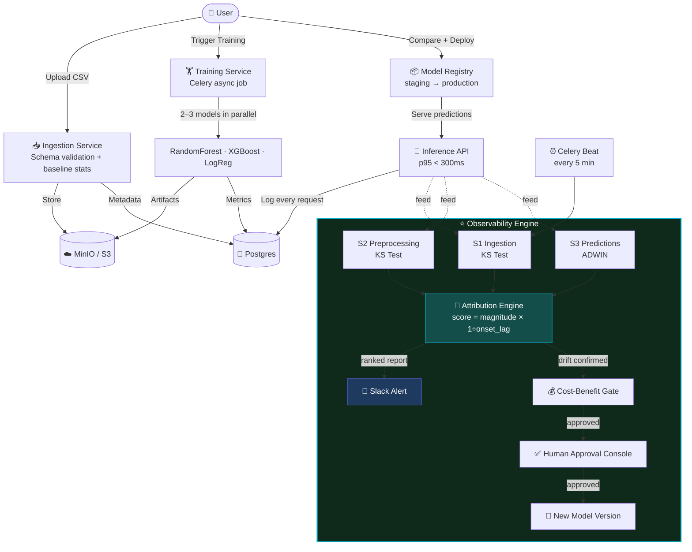
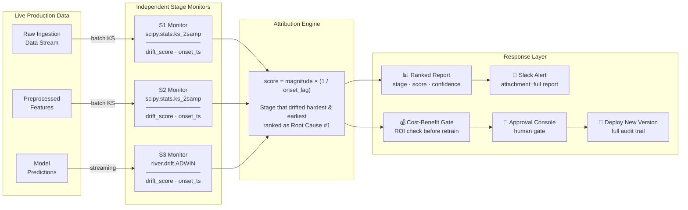
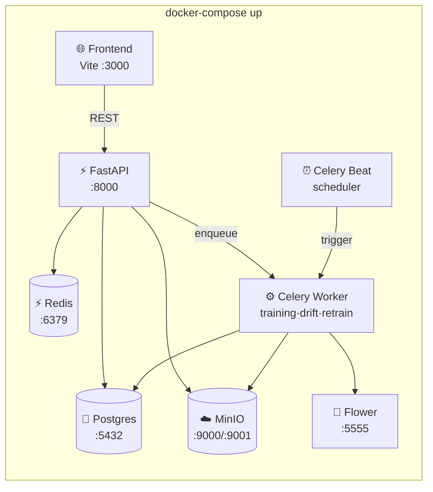
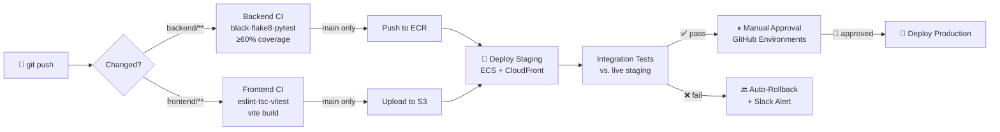

<div align="center">

# 🧠 MLOps Observability Platform

**An industry-grade MLOps platform with stage-wise drift detection and root-cause attribution.**

[](https://github.com/Dinesh-kumar9/Drift_Detection/actions/workflows/backend-ci.yml)
[](https://github.com/Dinesh-kumar9/Drift_Detection/actions/workflows/frontend-ci.yml)
[](LICENSE)
[](https://python.org)
[](https://fastapi.tiangolo.com)
[](https://react.dev)
[](https://www.typescriptlang.org)

</div>

---

## 🗺️ System Architecture



> **Core Differentiator:** Most MLOps tools only flag "drift detected" at the model output. This platform independently monitors **3 pipeline stages** and uses a temporal-magnitude engine to pinpoint *which* stage caused it.

```
attribution_score(stage) = drift_magnitude × (1 / onset_lag_seconds)
The stage that drifted hardest AND earliest → ranked #1 root cause
```

---

## 🔄 How It Works — End to End



---

## 📡 Observability Engine — Deep Dive



---

## ⚡ Quick Start

**Requirement:** Docker Desktop

```bash
git clone https://github.com/Dinesh-kumar9/Drift_Detection.git
cd Drift_Detection

cp backend/.env.example backend/.env   # configure secrets

docker-compose up --build
```

| Service | URL | Credentials |
|---|---|---|
| **Frontend** | http://localhost:3000 | — |
| **Backend Swagger** | http://localhost:8000/docs | — |
| **MinIO Console** | http://localhost:9001 | minioadmin / minioadmin |
| **Flower** (task monitor) | http://localhost:5555 | — |

---

## 🏗️ Local Stack — All 8 Services



---

## 🛠️ Tech Stack

| Layer | Technology | Purpose |
|---|---|---|
| **Frontend** | React 18 + Vite + TypeScript | Fast dev loop, type-safe API contracts |
| **Styling** | Tailwind CSS v3 | Dark-mode design system |
| **Charts** | Recharts | Drift trend time-series |
| **Server state** | TanStack Query | Caching, auto-refresh |
| **API** | FastAPI (Python 3.11) | Async, auto OpenAPI docs |
| **ORM** | SQLAlchemy async + Alembic | DB migrations |
| **Task queue** | Celery + Redis | Non-blocking training/drift jobs |
| **Drift batch** | `scipy.stats.ks_2samp` | Feature distribution comparison |
| **Drift stream** | `river.drift.ADWIN` | Real-time prediction error monitoring |
| **ML** | scikit-learn + XGBoost | Classification + regression |
| **Storage** | MinIO (local) / AWS S3 (prod) | Datasets + model artifacts |
| **Database** | PostgreSQL 16 | Metadata, drift events, audit |
| **IaC** | Terraform (AWS) | VPC, RDS, S3, ECS, Cognito |
| **CI/CD** | GitHub Actions | Lint → test → staging → prod |

---

## 🗄️ Data Model (9 Tables)

```mermaid
erDiagram
    datasets ||--o{ experiment_runs : "trains"
    experiment_runs ||--o{ model_versions : "produces"
    model_versions ||--o{ predictions : "generates"
    model_versions ||--o{ drift_events : "monitored by"
    model_versions ||--o{ retrain_jobs : "triggers"

    datasets { uuid id; varchar name; varchar s3_path; jsonb baseline_stats }
    experiment_runs { uuid id; varchar model_type; jsonb metrics; enum status }
    model_versions { uuid id; varchar version_tag; enum status; enum sla_tier }
    predictions { uuid id; jsonb input; jsonb output; float latency_ms }
    drift_events { uuid id; enum stage; float drift_score; timestamp onset_ts }
    attribution_reports { uuid id; jsonb ranked_stages; float confidence }
    retrain_jobs { uuid id; float cost_estimate; enum status; uuid approved_by }
    audit_logs { uuid id; varchar action; varchar actor_email; jsonb metadata }
```

---

## 🚦 CI/CD Pipeline



---

## 📋 Build Phases

| Phase | Goal | Status |
|---|---|---|
| **Phase 0** — Foundation | Scaffold, Docker Compose, CI/CD, Architecture | ✅ **Complete** |
| **Phase 1** — Core Lifecycle | Upload → Train → Compare → Deploy → Predict | 🔲 Planned |
| **Phase 2** — Observability ⭐ | Stage drift detection + root-cause attribution | 🔲 Planned |
| **Phase 3** — Retraining Loop | Cost-gated, human-approved closed-loop retrain | 🔲 Planned |
| **Phase 4** — Hardening | Auth/RBAC, SLA tiers, multi-tenant dashboard | 🔲 Planned |

> ⚠️ **Phase 2 is non-negotiable** — it is the core differentiator. Without it, this is just another MLOps CRUD app.

---

## 📡 API Surface

Interactive docs: **http://localhost:8000/docs** | Spec: [`docs/api-spec.yaml`](docs/api-spec.yaml)

```
POST   /auth/login                           Authenticate → JWT
POST   /datasets                             Upload + schema-validate CSV
POST   /experiments/train                    Kick off multi-model training (async)
GET    /experiments/{id}/compare             Side-by-side metrics comparison
POST   /models/{id}/deploy                   Promote to production
POST   /models/{id}/predict                  Inference (p95 < 300ms)
GET    /observability/{id}/drift         ⭐  Stage-wise drift status
GET    /observability/{id}/attribution   ⭐  Root-cause attribution report
POST   /retrain/{id}/trigger                 Request retraining
POST   /retrain/{job_id}/approve             Human approval gate
GET    /audit-logs                           Filterable audit trail
```

---

## 📁 Repository Structure

```
Drift_Detection/
├── frontend/                   # React 18 + Vite + TypeScript
│   ├── src/
│   │   ├── api/client.ts       # Axios + JWT interceptor
│   │   ├── components/
│   │   │   └── Layout.tsx      # Sidebar + dark-mode shell
│   │   └── pages/              # 5 pages (Phase 1–3)
│   └── tailwind.config.js      # Brand design system
│
├── backend/
│   ├── app/
│   │   ├── core/               # Config · DB · Security
│   │   ├── models/             # 9 SQLAlchemy ORM tables
│   │   ├── api/                # 7 FastAPI routers
│   │   ├── services/drift/  ⭐ # stage_monitors · attribution · alert
│   │   └── workers/            # Celery (3 queues + Beat)
│   ├── alembic/                # Async DB migrations
│   └── Dockerfile              # Multi-stage: api / worker / beat
│
├── infra/terraform/            # AWS IaC (VPC·S3·RDS·ECS·Cognito)
├── .github/workflows/          # backend-ci · frontend-ci · deploy
├── docs/
│   ├── architecture.jpg     ← this diagram
│   ├── ARCHITECTURE.md         # Full Mermaid diagrams
│   └── api-spec.yaml           # OpenAPI 3.1
└── docker-compose.yml          # 8-service local stack
```

---

## 🤝 Contributing

```bash
git checkout -b feature/fr{N}-description   # one branch per requirement
# e.g. feature/fr8-stage-monitors  ← maps directly to FR8

git push origin feature/fr8-stage-monitors
# open PR → CI must pass → squash-merge
```

---

<div align="center">

MIT © 2026 Dinesh Kumar &nbsp;|&nbsp; [Architecture Docs](docs/ARCHITECTURE.md) &nbsp;|&nbsp; [API Spec](docs/api-spec.yaml)

</div>
