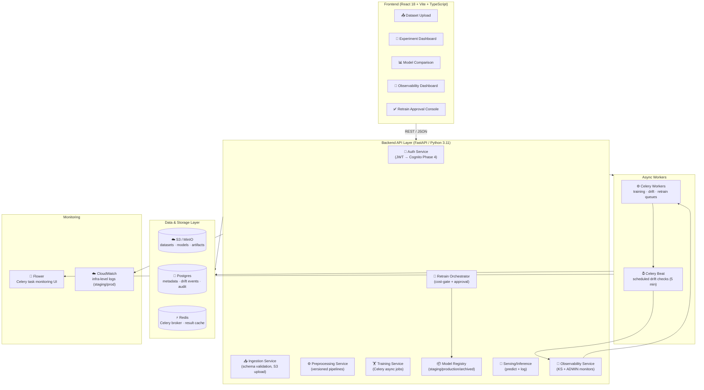
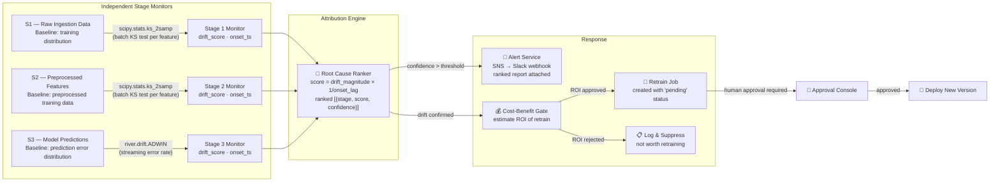
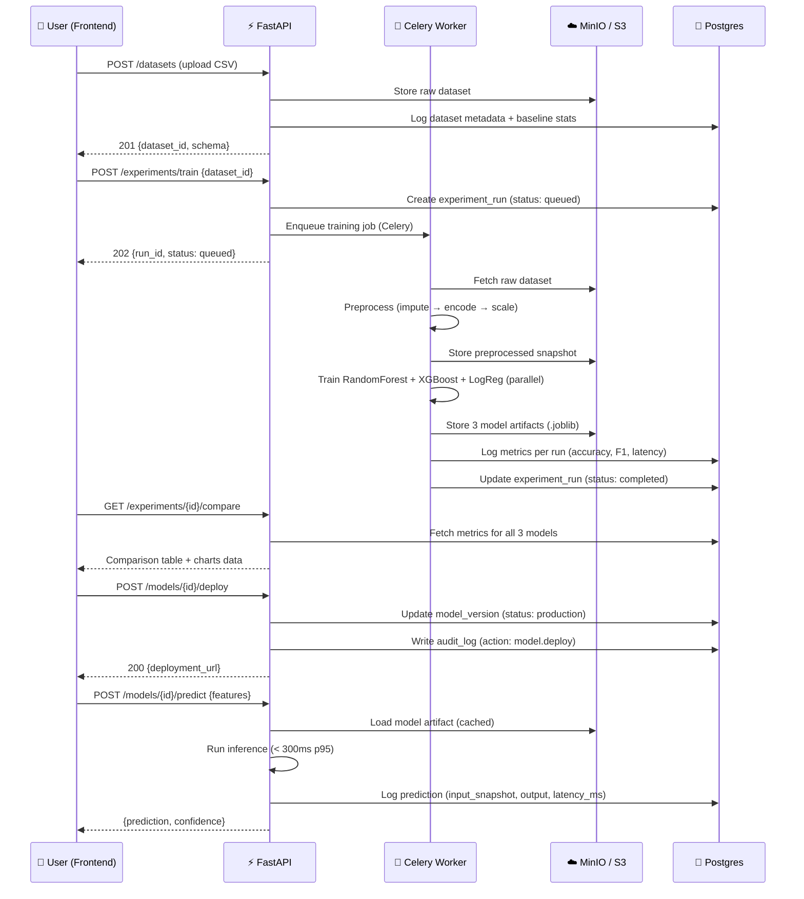
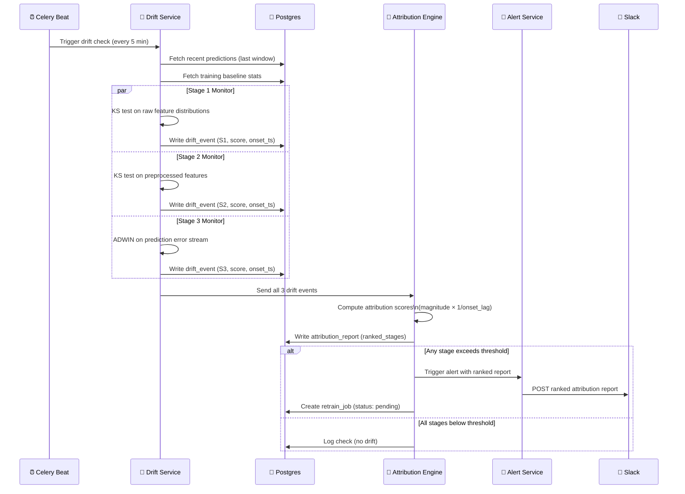
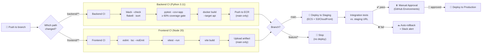
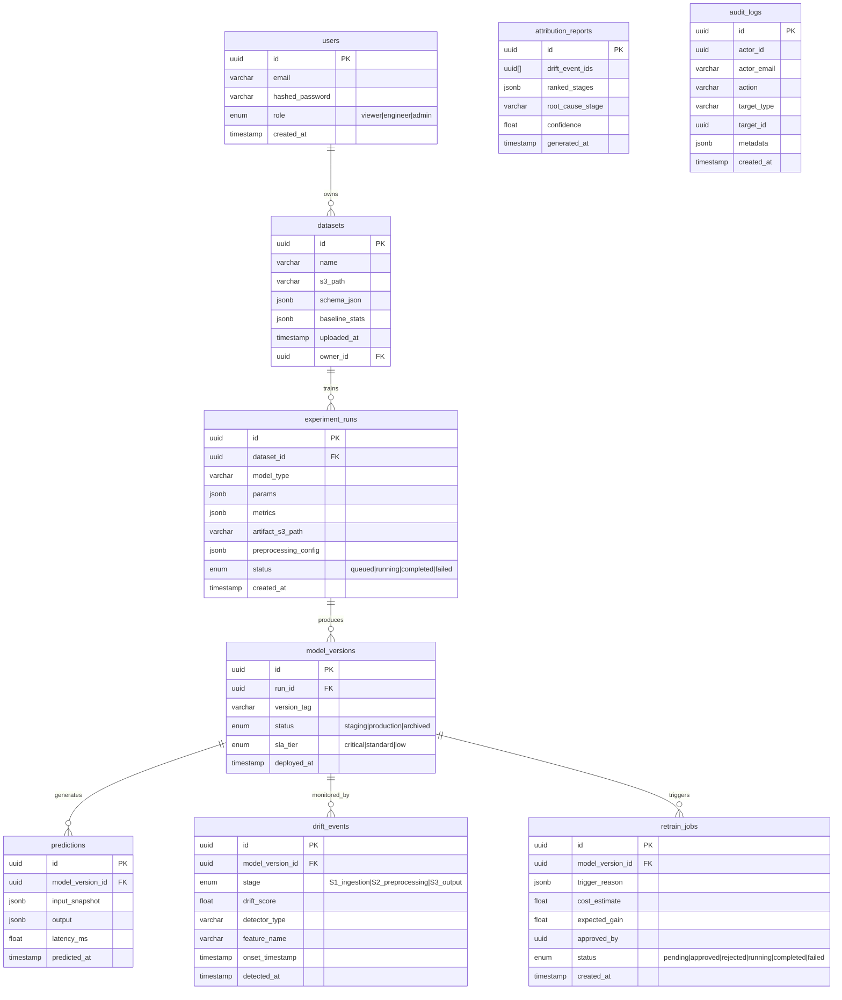

# Architecture — Multi-Model MLOps Observability Platform

> **Version:** 0.1.0 | **Last Updated:** 2026-09 | **Phase:** 0 (Foundation)

---

## Table of Contents
1. [System Overview](#1-system-overview)
2. [High-Level Component Diagram](#2-high-level-component-diagram)
3. [Observability Engine Detail](#3-observability-engine-detail)
4. [Request Flow — Training to Deployment](#4-request-flow--training-to-deployment)
5. [Drift Detection & Attribution Flow](#5-drift-detection--attribution-flow)
6. [CI/CD Pipeline](#6-cicd-pipeline)
7. [Database Schema](#7-database-schema)
8. [Repository Structure](#8-repository-structure)
9. [Local Development Stack](#9-local-development-stack)
10. [AWS Production Stack](#10-aws-production-stack)
11. [Tech Stack Decisions](#11-tech-stack-decisions)

---

## 1. System Overview

The platform covers the full ML model lifecycle across **five functional domains**:

| Domain | Core Capability | Key FR |
|---|---|---|
| **Ingestion & Storage** | CSV upload, schema validation, versioned datasets | FR1 |
| **Training Pipeline** | Parallel multi-model training, experiment tracking | FR2–FR5 |
| **Serving** | Containerised REST inference with request logging | FR6–FR7 |
| **Observability** | Stage-wise drift detection + root-cause attribution | FR8–FR11 |
| **Retraining Loop** | Cost-gated, human-approved closed-loop retraining | FR12–FR17 |

**Core differentiator:** Most MLOps tools flag "drift detected" at the output only. This platform independently monitors **three stages** (raw ingestion → preprocessed features → model predictions) and uses a **temporal-magnitude attribution engine** to rank which stage is the most likely root cause.

---

## 2. High-Level Component Diagram



---

## 3. Observability Engine Detail

The observability engine is the platform's **core differentiator** — three independent stage monitors feed a temporal-magnitude attribution engine that produces a ranked root-cause report.



### Attribution Algorithm

```
attribution_score(stage) =
    drift_magnitude(stage) × (1 / onset_lag_seconds(stage))

Where:
  drift_magnitude  = normalised drift score [0.0–1.0]
  onset_lag        = seconds between first threshold crossing and current detection
  
Stages are ranked descending by attribution_score.
The stage that drifted hardest AND earliest ranks #1 (most likely root cause).
```

---

## 4. Request Flow — Training to Deployment



---

## 5. Drift Detection & Attribution Flow



---

## 6. CI/CD Pipeline



### Branch Strategy

| Branch | Purpose | Merge policy |
|---|---|---|
| `main` | Always deployable | Require PR + passing CI |
| `feature/fr{N}-{slug}` | One branch per requirement | Squash-merge to `main` |

**Example:** `feature/fr8-stage-monitors` maps directly to FR8.

---

## 7. Database Schema



---

## 8. Repository Structure

```
mlops-observability-platform/
│
├── frontend/                        # React 18 + Vite + TypeScript
│   ├── src/
│   │   ├── api/
│   │   │   └── client.ts            # Axios instance + JWT interceptor
│   │   ├── components/
│   │   │   ├── Layout.tsx           # Sidebar + header shell
│   │   │   ├── DriftChart.tsx       # Phase 2: Recharts drift trend
│   │   │   └── AttributionPanel.tsx # Phase 2: Root-cause bar chart
│   │   ├── pages/
│   │   │   ├── DatasetUpload.tsx    # Phase 1
│   │   │   ├── ExperimentDashboard.tsx  # Phase 1
│   │   │   ├── ModelComparison.tsx  # Phase 1
│   │   │   ├── ObservabilityDashboard.tsx  # Phase 2
│   │   │   └── RetrainApproval.tsx  # Phase 3
│   │   ├── App.tsx                  # Router + QueryClient
│   │   └── index.css                # Tailwind + design system
│   ├── Dockerfile.dev
│   └── tailwind.config.js
│
├── backend/
│   ├── app/
│   │   ├── api/                     # FastAPI routers
│   │   │   ├── auth.py
│   │   │   ├── datasets.py          # Phase 1
│   │   │   ├── experiments.py       # Phase 1
│   │   │   ├── models.py            # Phase 1
│   │   │   ├── observability.py     # Phase 2
│   │   │   ├── retrain.py           # Phase 3
│   │   │   └── audit.py             # Phase 3
│   │   ├── core/
│   │   │   ├── config.py            # Pydantic settings
│   │   │   ├── database.py          # Async SQLAlchemy engine
│   │   │   └── security.py          # JWT + RBAC
│   │   ├── models/
│   │   │   └── __init__.py          # All 9 ORM models
│   │   ├── schemas/                 # Pydantic request/response models
│   │   ├── services/
│   │   │   ├── ingestion_service.py     # Phase 1
│   │   │   ├── preprocessing_service.py # Phase 1
│   │   │   ├── training_service.py      # Phase 1
│   │   │   ├── registry_service.py      # Phase 1
│   │   │   ├── serving_service.py       # Phase 1
│   │   │   └── drift/
│   │   │       ├── stage_monitors.py    # Phase 2 ← core differentiator
│   │   │       ├── attribution_engine.py # Phase 2
│   │   │       ├── alert_service.py     # Phase 2
│   │   │       └── cost_benefit_gate.py # Phase 3
│   │   ├── workers/
│   │   │   ├── celery_app.py
│   │   │   ├── training_tasks.py    # Phase 1
│   │   │   ├── drift_tasks.py       # Phase 2
│   │   │   └── retrain_tasks.py     # Phase 3
│   │   └── main.py
│   ├── alembic/                     # DB migrations
│   ├── tests/
│   │   ├── unit/
│   │   └── integration/
│   ├── Dockerfile
│   ├── alembic.ini
│   └── requirements.txt
│
├── infra/
│   └── terraform/
│       ├── vpc.tf
│       ├── s3.tf
│       ├── rds.tf
│       ├── ecs.tf
│       ├── cognito.tf
│       └── variables.tf
│
├── .github/
│   └── workflows/
│       ├── backend-ci.yml           # Lint → test → ECR push
│       ├── frontend-ci.yml          # Lint → typecheck → build
│       └── deploy.yml               # Staging → integration → approval → production
│
├── docs/
│   ├── ARCHITECTURE.md              # ← this file
│   └── api-spec.yaml                # OpenAPI spec
│
├── docker-compose.yml               # Local dev: all 8 services
└── README.md
```

---

## 9. Local Development Stack

All services run via a single `docker-compose up --build`:

| Service | Port | Purpose |
|---|---|---|
| `postgres` | 5432 | PostgreSQL 16 — metadata, drift events, audit logs |
| `redis` | 6379 | Celery broker + result backend |
| `minio` | 9000 | S3-compatible object storage (datasets, models) |
| `minio` console | 9001 | MinIO web UI |
| `backend` (API) | 8000 | FastAPI — Swagger docs at `/docs` |
| `worker` | — | Celery training/drift/retrain workers |
| `beat` | — | Celery Beat — scheduled drift checks |
| `flower` | 5555 | Celery task monitoring UI |
| `frontend` | 3000 | Vite dev server (hot reload) |

```bash
# Quick start
git clone <repo>
cd mlops-observability-platform
cp backend/.env.example backend/.env
docker-compose up --build

# Access points
# Frontend:       http://localhost:3000
# Backend API:    http://localhost:8000/docs
# MinIO Console:  http://localhost:9001  (minioadmin / minioadmin)
# Flower:         http://localhost:5555
```

---

## 10. AWS Production Stack

| Component | AWS Service | Notes |
|---|---|---|
| Object Storage | S3 | Versioned, AES-256 encrypted |
| Database | RDS Postgres 16 | Multi-AZ in production, managed password rotation |
| Cache / Queue | ElastiCache (Redis) | Celery broker |
| Compute | ECS Fargate | API + worker containers, no server management |
| Container Registry | ECR | Image lifecycle policy: keep last 10 |
| Auth | Cognito | Phase 4 — JWT swapped for Cognito tokens |
| CDN | CloudFront | Frontend static bundle |
| Secrets | Secrets Manager | DB credentials, API keys — never in code |
| Alerting | SNS → Slack | Drift attribution reports |
| IaC | Terraform | `infra/terraform/` — define now, provision in Phase 1 |

---

## 11. Tech Stack Decisions

| Layer | Choice | Rationale |
|---|---|---|
| API Framework | FastAPI (Python 3.11) | Async, auto-OpenAPI, typed |
| ORM | SQLAlchemy async + Alembic | Migrations, type-safe queries |
| Task Queue | Celery + Redis | Non-blocking training jobs |
| Scheduler | Celery Beat → Airflow (Phase 2+) | Start simple, DAG complexity when needed |
| Drift (batch) | `scipy.stats.ks_2samp` | Non-parametric, works on any distribution |
| Drift (stream) | `river.drift.ADWIN` | Adaptive windowing, ideal for error rate streams |
| Frontend | React 18 + Vite + TypeScript | Fast dev loop, type safety for API contracts |
| UI | Tailwind CSS v3 | PRD-specified, rapid consistent styling |
| Charts | Recharts | React-native, good for time-series |
| Server state | TanStack Query | Caching, deduplication, no Redux overhead |
| Local S3 | MinIO | S3-compatible API, zero AWS cost for dev |
| Auth (Phase 0–3) | JWT (local) | Simpler; swap for Cognito in Phase 4 |
| IaC | Terraform | Reproducible, version-controlled AWS infra |
| CI/CD | GitHub Actions | PRD-specified |
